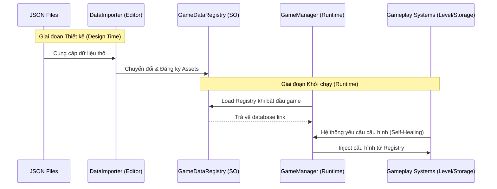

# NTVV - Tài liệu Kiến trúc Cốt lõi & Dữ liệu (Core & Data Architecture)

Tài liệu này giải thích chi tiết về cấu trúc vận hành ngầm của dự án NTVV, từ cách quản lý các Manager cho đến luồng luân chuyển dữ liệu từ file thô vào Game.

---

## 🏗 1. Kiến trúc Singleton Core (Managers)

Game sử dụng mô hình **Singleton** để quản lý các hệ thống toàn cục. Các Manager này kế thừa từ `Singleton<T>`, đảm bảo chỉ có một Instance duy nhất tồn tại và có thể truy cập từ bất cứ đâu.

| Manager | Script Path | Vai trò chính | Biến quan trọng |
| :--- | :--- | :--- | :--- |
| **GameManager** | `Managers/GameManager.cs` | Điều phối toàn bộ vòng đời game (Boot, Gameplay, Pause). Giữ tham chiếu đến Registry. | `DataRegistry`, `CurrentState` |
| **EconomySystem** | `Gameplay/Economy/EconomySystem.cs` | Quản lý tiền tệ (Vàng). Xử lý thu chi. | `_currentGold` |
| **LevelSystem** | `Gameplay/Progression/LevelSystem.cs` | Quản lý XP, Cấp độ và Milestones. | `_currentLevel`, `_currentXP` |
| **StorageSystem** | `Gameplay/Storage/StorageSystem.cs` | Quản lý vật phẩm trong kho và sức chứa. | `_items`, `_currentCapacity` |
| **TimeManager** | `Core/TimeManager.cs` | Phát sự kiện `OnTick` (mỗi giây) để cây trồng và thú nuôi phát triển. | `_tickInterval` |
| **QuestManager** | `Gameplay/Quests/QuestManager.cs` | Theo dõi tiến trình nhiệm vụ và lưu trữ danh sách nhiệm vụ đang thực hiện. | `_activeQuests` |
| **PopupManager** | `UI/Common/PopupManager.cs` | Quản lý việc mở/đóng các cửa sổ (Panel, Modal) theo Theme. | `_activePopups` |

---

## 💎 2. Quản lý Dữ liệu Asset (ScriptableObjects)

Dữ liệu tĩnh của Game (Static Data) được lưu trữ dưới dạng **ScriptableObjects (SO)**. Điều này giúp tách biệt dữ liệu khỏi logic code.

### 📍 GameDataRegistry (Trái tim của Dữ liệu)
- **File**: `Assets/_Project/Data/Registry/GameDataRegistry.asset`
- **Vai trò**: Đây là **"Single Source of Truth"** (Nguồn sự thật duy nhất). Toàn bộ các hệ thống khác sẽ nhìn vào đây để lấy cấu hình.
- **Nội dung**: Chứa danh sách link tới toàn bộ Crops, Animals, Quests và các Config hệ thống.

### 📂 Các loại Data Asset khác
- **CropDataSO**: Thông tin về loại cây (Thời gian lớn, XP, giá bán).
- **AnimalDataSO**: Thông tin về vật nuôi (Sản lượng, thời gian sản xuất).
- **QuestDataSO**: Cấu hình nhiệm vụ (Mục tiêu, phần thưởng).
- **StorageUpgradeDataSO**: Danh sách các Tier nâng cấp kho.
- **PlayerLevelData**: Danh sách XP cần thiết cho từng cấp.

---

## 📂 3. Dữ liệu Nguồn (JSON Data Sources)

Để dễ dàng chỉnh sửa số lượng lớn dữ liệu (như cân bằng game), chúng ta sử dụng JSON làm nguồn sơ cấp.

- **Thư mục**: `Assets/_Project/Settings/DataSources/JSON/`
- **Cấu trúc**: Mỗi file JSON (ví dụ: `Crops.json`) chứa một mảng các Item với các ID duy nhất (`crop_wheat`, `animal_chicken`).
- **Công cụ đồng bộ (DataImporter)**:
    - Nằm tại: `NTVV > Tools > Import Static Data`.
    - Cách hoạt động: Đọc JSON -> Tạo/Cập nhật các file `.asset` tương ứng -> Tự động đăng ký chúng vào `GameDataRegistry`.

### 📂 UI Assets & Metadata Standards
Để hỗ trợ hệ thống Atomic HUD, mọi UI Sprite nạp vào Unity phải tuân thủ:
-   **Naming**: Hậu tố `_Atomic` cho các layer thô (ví dụ: `bg_Button_Green_Atomic`).
-   **Góc nhìn (Perspective)**: 
    -   Nền (Background): **Frontal Orthographic** (Không biến dạng phối cảnh).
    -   Icons: **Isometric** (Góc 45 độ top-down).
-   **Import Settings**: 
    -   `Texture Type: Sprite (2D and UI)`.
    -   `Mesh Type: Full Rect` (Yêu cầu bắt buộc để 9-slicing hoạt động chính xác trên các góc bo tròn AI).
    -   `Alpha Source: Input Texture Alpha` (Nếu đã tách nền).

---

## 🔄 4. Quy trình Nạp & Khởi tạo (Initialization Flow)

Dưới đây là sơ đồ mô tả cách dữ liệu được nạp vào Game:

---

## 📋 5. Tổng hợp Biến Quan trọng & Tham chiếu Nhanh

Khi lập trình các tính năng mới, bạn sẽ thường xuyên tương tác với các biến sau:

| Hệ thống | Cách truy cập | Biến/Hàm cần chú ý |
| :--- | :--- | :--- |
| **Tiền vàng** | `EconomySystem.Instance` | `CurrentGold`, `AddGold(int)`, `CanAfford(int)` |
| **Cấp độ** | `LevelSystem.Instance` | `CurrentLevel`, `AddXP(int)`, `LevelUp` events |
| **Kho** | `StorageSystem.Instance` | `AddItem(string id, int count)`, `HasItem(string id)` |
| **Nhiệm vụ** | `QuestEvents` | `OnQuestProgress?.Invoke(type, id, amount)` |
| **Cấu hình** | `GameManager.Instance.DataRegistry` | Truy cập trực tiếp danh sách `crops`, `animals`. |

> [!TIP]
> **Quy tắc vàng**: Đừng bao giờ kéo thả trực tiếp `CropDataSO` vào một Script trong Scene. Hãy bắt đầu từ `GameDataRegistry` để đảm bảo game luôn chạy đúng dữ liệu mới nhất được Sync từ JSON.
